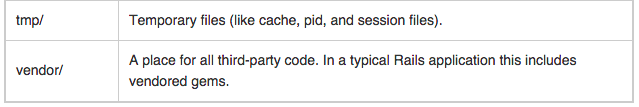

# Intro to Rails

---

### What is Rails?
- Rails is a web application development framework written in the Ruby language. It is designed to make programming web applications easier by making assumptions about what every developer needs to get started. It allows you to write less code while accomplishing more than many other languages and frameworks. Experienced Rails developers also report that it makes web application development more fun.

- Rails is opinionated software. It makes the assumption that there is the "best" way to do things, and it's designed to encourage that way - and in some cases to discourage alternatives. If you learn "The Rails Way" you'll probably discover a tremendous increase in productivity. If you persist in bringing old habits from other languages to your Rails development, and trying to use patterns you learned elsewhere, you may have a less happy experience.

### The Rails philosophy includes two major guiding principles:

### Don't Repeat Yourself:
- DRY is a principle of software development which states that "Every piece of knowledge must have a single, unambiguous, authoritative representation within a system." By not writing the same information over and over again, our code is more maintainable, more extensible, and less buggy.
Convention Over Configuration: Rails has opinions about the best way to do many things in a web application, and defaults to this set of conventions, rather than require that you specify every minutiae through endless configuration files.

# MVC Archetcture

### M

- Model

### View

- View

### C

- Controller

### Understanding The Model-View-Controller Pattern
- Rails is built around the model-view-controller pattern. It’s a simple concept: separate the data, logic, and display layers of your program. This lets you split functionality cleanly, just like having separate HTML, CSS and Javascript files prevents your code from mushing together. Here’s the MVC breakdown:

- Models are classes that talk to the databse. You find, create and save models, so you don’t (usually) have to write SQL. Rails has a class to handle the magic of saving to a database when a model is updated.

- Controllers take user input (like a URL) and decide what to do (show a page, order an item, post a comment). They may initially have business logic, like finding the right models or changing data. As your rails ninjitsu improves, constantly refactor and move business logic into the model (fat model, skinny controller). Ideally, controllers just take inputs, call model methods, and pass outputs to the view (including error messages).

- Views display the output, usually HTML. They use ERB and this part of Rails is like PHP – you use HTML templates with some Ruby variables thrown in. Rails also makes it easy to create views as XML (for web services/RSS feeds) or JSON (for AJAX calls).
The MVC pattern is key to building a readable, maintainable and easily-updateable web app.

 

---

# Rails anatomy




---

# Rails first example

The most basic object we can have looks like this:

````ruby
rails new testApp
cd testApp
rails server

````

Generate rails application and look at all that was created for us

# Rails generators example

````
rails generate controller main index

````

navigate to the main route so that we can see the page we just created

### Error
Take a look at the error page and see why we are getting an error

# Share variables with a view

````
#controller 
def index
	@name = "[your name]"
end

#view
<h2><%= @name %></h2>

````

#ERB Template Syntax
````
<% %>
Executes the ruby code within the brackets.

<%= %>
Prints something into erb file.

<% -%>
Avoids line break after expression.

<%# %>
Comments out code within brackets; not sent to client (as opposed to HTML comments).

````

